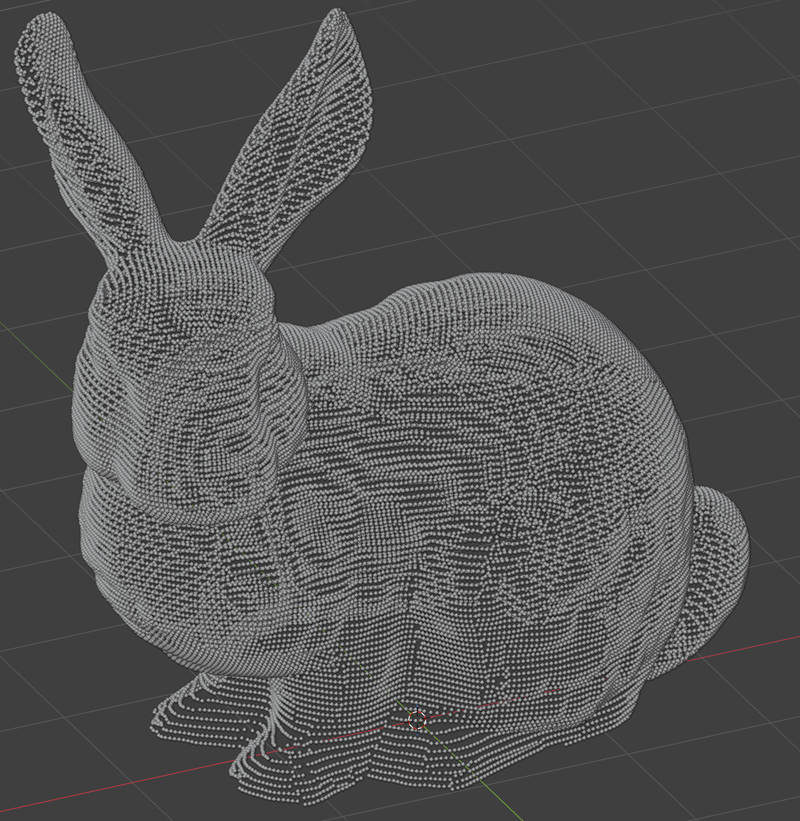
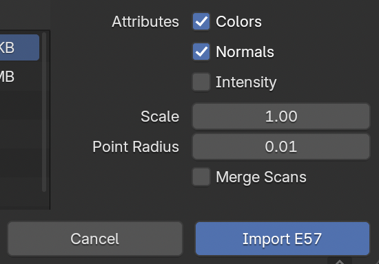
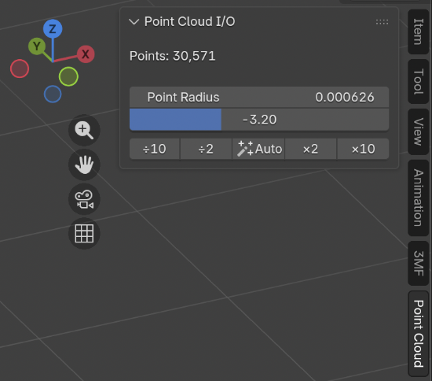

# Point Cloud I/O for Blender

A Blender 5.0+ extension for importing and exporting point cloud files. Built around Blender's native **PointCloud** object type.



## Supported formats

| Format | Import | Export |
|--------|:------:|:------:|
| E57 (`.e57`) | ✅ | ✅ (no normals) |
| PLY (`.ply`) | ✅ | ✅ (ASCII or binary) |
| LAS / LAZ (`.las`, `.laz`) | ✅ | ✅ |
| PCD (`.pcd`) | ✅ (ASCII / binary) | ✅ (ASCII or binary) |
| XYZ (`.xyz`, `.txt`, `.csv`) | ✅ | ✅ |

## About E57

ASTM E57 is a compact, vendor-neutral container for point clouds, images, and metadata produced by 3D imaging systems — LiDAR, terrestrial laser scanners, structured-light rigs. A single `.e57` file can carry multiple scans, each with its own pose, color, intensity, and (via extensions) normals.

- [libe57.org](http://www.libe57.org/) — official format home and specification
- [Sample E57 files](http://www.libe57.org/data.html) — public test datasets (Stanford bunny, scan stations, etc.)
- [Coordinate system conventions](http://www.libe57.org/bestCoordinates.html) — how scanners encode pose and orientation; useful when imported clouds appear flipped or rotated

## About LAS / LAZ

ASPRS LAS is the dominant format for **airborne and terrestrial LiDAR** data. Each point stores a position (quantized to int32 with a header-declared scale and offset), 16-bit intensity, return-number metadata for multi-return LiDAR, and an ASPRS classification code (ground, building, vegetation, water, etc.). LAS is uncompressed; **LAZ** is the same content compressed via LASzip — typically 10–20 % of the original size with no loss.

- [ASPRS LAS specification](https://www.asprs.org/divisions-committees/lidar-division/laser-las-file-format-exchange-activities) — official format home, including the current LAS 1.4 PDF
- [USGS Lidar Explorer](https://apps.nationalmap.gov/lidar-explorer/) — free public LiDAR coverage of the United States; download `.laz` tiles by drawing a polygon on the map
- [OpenTopography](https://portal.opentopography.org/datasets) — curated LiDAR datasets from research and government sources around the world

**Small samples for quick testing:**

- [`laspy` test data](https://github.com/laspy/laspy/tree/main/tests/data) — handful of tiny LAS/LAZ files (≤ a few hundred KB) covering different point-data record formats. Good for verifying your import path works.
- [PDAL test data](https://github.com/PDAL/PDAL/tree/master/test/data/las) — slightly larger variety with georeferenced examples.
- [Autzen Stadium (`autzen.laz`)](https://github.com/PDAL/data/raw/master/autzen/autzen.laz) — ~50 MB, classic LiDAR demo dataset (~10M points, real-world UTM coords). Great for stress-testing.

> Heads up: most "real" LAS files use **georeferenced coordinates** (UTM, State Plane), so the cloud lands millions of metres from origin. The importer's **Center on Origin** option (on by default) subtracts the data minimum so you can actually see the result. The original offset is stored as a `las_origin_offset` custom property on the object and added back on export.
>
> Aerial LiDAR clouds also tend to be **kilometres across**, which makes a 5 cm point radius sub-pixel on the viewport. The importer's **Auto Point Radius** option (also on by default) picks a sensible radius from the cloud's extent and density — typically tens of metres for landscape-scale data, sub-millimetre for room-scale scans.

## Requirements

- **Blender 5.0** or newer (Python 3.13)

The required Python wheels (`pye57`, `pyquaternion`) are bundled with the extension — no internet needed at install time.

## Installation

1. Build a ZIP from the `point_cloud_io/` directory (or download a release):

   ```bash
   cd point_cloud_io
   zip -r ../point_cloud_io.zip .
   ```

2. In Blender: `Edit > Preferences > Get Extensions`.
3. Click the drop-down (top right) → **Install from Disk**.
4. Pick `point_cloud_io.zip` and enable the extension.

## Usage

### Importing E57

`File > Import > E57 Point Cloud (.e57)`



Options in the sidebar:

- **Colors** — extract RGB and write a `color` point attribute.
- **Normals** — extract normal vectors as a `normal` point attribute.
- **Intensity** — extract scalar intensity (LiDAR return strength) normalised to 0–1.
- **Scale** — global multiplier applied to coordinates.
- **Point Radius** — visible radius written to the `radius` point attribute.
- **Merge Scans** — combine all scans in the file into one PointCloud object.

To see colors in the viewport, switch to **Material Preview** or **Rendered** shading.

### Exporting E57

`File > Export > E57 Point Cloud (.e57)`

Each selected PointCloud object becomes one scan in the output file.

Options:

- **Colors** — write the `color` attribute as RGB uint8 (0–255).
- **Intensity** — write the `intensity` attribute as a float field.
- **Apply Modifiers** — evaluate the depsgraph first so Geometry Nodes-driven clouds are captured at their final state.
- **Apply Transforms** — bake object Location/Rotation/Scale into the exported coordinates.
- **Selection Only** — when off, every PointCloud in the scene is exported.

**Note:** normals are not written. `pye57`'s writer (which wraps libE57Format) only exposes cartesian / spherical / intensity / color / index fields. Normals are an extension field and would require bypassing `write_scan_raw`.

### Importing PLY

`File > Import > PLY Point Cloud (.ply)`

Reads positions (`x y z`), colors (`red green blue [alpha]`, auto-detects 0–255 vs 0–1 ranges), normals (`nx ny nz`), and any other per-vertex scalar properties as point attributes. ASCII and binary little-endian / big-endian variants are supported. The reader is pure Python + numpy — no extra wheel dependencies.

> Note: this entry is distinct from Blender's built-in `File > Import > Stanford PLY (.ply)`, which produces a **mesh**. The Point Cloud I/O entry produces a **PointCloud** object — much faster for million-point datasets and easier to drive with Geometry Nodes.

### Exporting PLY

`File > Export > PLY Point Cloud (.ply)`

Writes positions, normals, colors (as RGB uint8), and any extra `FLOAT` / `INT` / `BOOLEAN` POINT-domain attributes. Binary little-endian by default; tick **ASCII** for a human-readable file.

### Importing LAS / LAZ

`File > Import > LAS/LAZ Point Cloud (.las, .laz)`

Reads positions (with the file's scale + offset applied), RGB (16-bit → normalized), intensity (normalized to 0–1), classification (uint8 → INT attribute), and optional return-number / number-of-returns. Compressed `.laz` files are decompressed by the bundled `lazrs` codec.

Classification codes follow the ASPRS standard: `2 = ground`, `5 = high vegetation`, `6 = building`, `9 = water`, etc. The values land in an `INT` point attribute named `classification` so you can drive material colors or visibility per-class in Geometry Nodes.

### Exporting LAS / LAZ

`File > Export > LAS/LAZ Point Cloud (.las, .laz)`

Writes Point Data Record Format 3 (LAS 1.2) — broadly compatible, includes RGB + intensity + classification + return info + GPS time. Tick **Compress (LAZ)** to write `.laz` via the `lazrs` codec.

Positions are quantized to millimeter precision (`scale=0.001`), with the offset set to the data minimum so the int32 storage stays in range. Color is upscaled from Blender's 8-bit to LAS's 16-bit channels.

### Importing PCD

`File > Import > PCD Point Cloud (.pcd)`

Reads positions (`x y z`), normals (`normal_x/y/z`), packed RGB / RGBA, intensity, and any other per-point scalar fields as point attributes. Supports all three PCD data modes: **`ascii`**, **`binary`**, and **`binary_compressed`** (LZF). LZF compression is handled by a pure-Python decompressor — no extra wheels.

### Exporting PCD

`File > Export > PCD Point Cloud (.pcd)`

Writes a single unordered cloud (`HEIGHT = 1`). Columns are `x y z` + optionally `normal_x/y/z`, packed `rgb`, and `intensity`. The **Data Mode** dropdown chooses between `binary` (default), `binary_compressed` (LZF — same as PCL writes by default, smaller files), or `ascii`. Multiple selected PointCloud objects are concatenated into one PCD.

### Importing XYZ

`File > Import > XYZ Point Cloud (.xyz, .txt, .csv)`

Plain-text format with no header — column layout is inferred:

| Columns | Interpretation |
|---:|---|
| 3 | `x y z` |
| 4 | `x y z intensity` |
| 6 | `x y z r g b` (auto-detects 0–1 vs 0–255) |
| 7 | `x y z intensity r g b` |
| 9 | `x y z r g b nx ny nz` |
| other | first 3 are positions, remaining columns become `extra_0`, `extra_1`, … FLOAT attributes |

Comma-separated values are auto-detected from the first data line; `#`-prefixed comment lines are skipped.

### Exporting XYZ

`File > Export > XYZ Point Cloud (.xyz)`

Always ASCII. Column order: `x y z [intensity] [r g b] [nx ny nz]`. Tick the **Write Colors / Normals / Intensity** options to include each section; columns are only emitted when the underlying attribute exists on every exported object.

### Sidebar panel

After importing, press **N** in the 3D Viewport → **Point Cloud** tab. The panel shows point count and present attributes, plus a radius control with a logarithmic slider and `÷10 / ÷2 / Auto / ×2 / ×10` buttons for quick magnitude changes.



## Project layout

```
point_cloud_io/
├── __init__.py              # extension entry point
├── blender_manifest.toml    # Blender extension manifest
├── operators/
│   ├── __init__.py          # operator registration + menu wiring
│   ├── import_e57.py        # File > Import > E57 operator
│   ├── export_e57.py        # File > Export > E57 operator
│   ├── import_ply.py        # File > Import > PLY operator
│   ├── export_ply.py        # File > Export > PLY operator
│   ├── import_las.py        # File > Import > LAS/LAZ operator
│   ├── export_las.py        # File > Export > LAS/LAZ operator
│   ├── import_pcd.py        # File > Import > PCD operator
│   ├── export_pcd.py        # File > Export > PCD operator
│   ├── import_xyz.py        # File > Import > XYZ operator
│   └── export_xyz.py        # File > Export > XYZ operator
├── formats/
│   ├── __init__.py
│   ├── _common.py           # shared PointCloud build / read helpers
│   ├── e57.py               # E57 read + write logic
│   ├── ply.py               # PLY read + write logic
│   ├── las.py               # LAS/LAZ read + write logic
│   ├── pcd.py               # PCD read + write logic
│   └── xyz.py               # XYZ read + write logic
├── ui/
│   ├── __init__.py
│   └── panel.py             # 3D Viewport sidebar (N-panel)
└── wheels/                  # bundled cp313 wheels (pye57, pyquaternion)
```

Adding a new format means dropping `formats/<format>.py` and a matching `operators/import_<format>.py` (or `export_<format>.py`) and wiring it up in `operators/__init__.py`.

## Credits

Uses [pye57](https://github.com/davidcaron/pye57) (libE57Format Python bindings).

## License

GPL-3.0-or-later. Bundled wheels (`pye57`, `pyquaternion`) remain under their original licenses (MIT).
